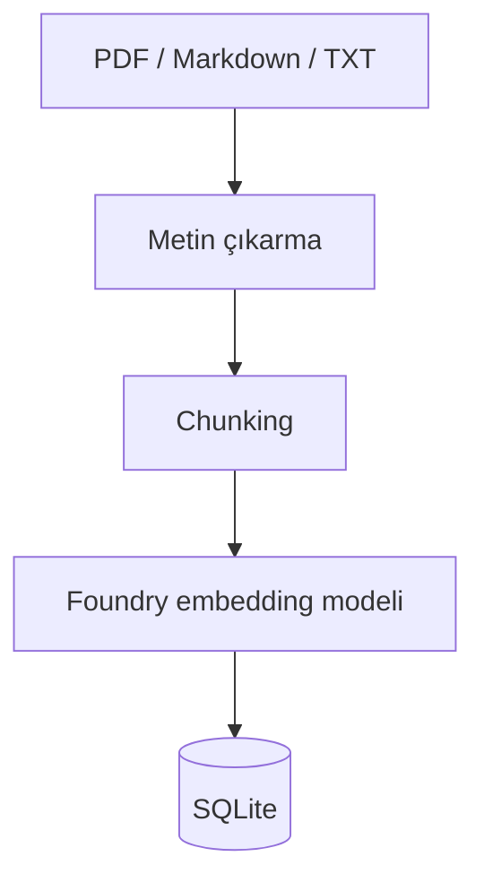
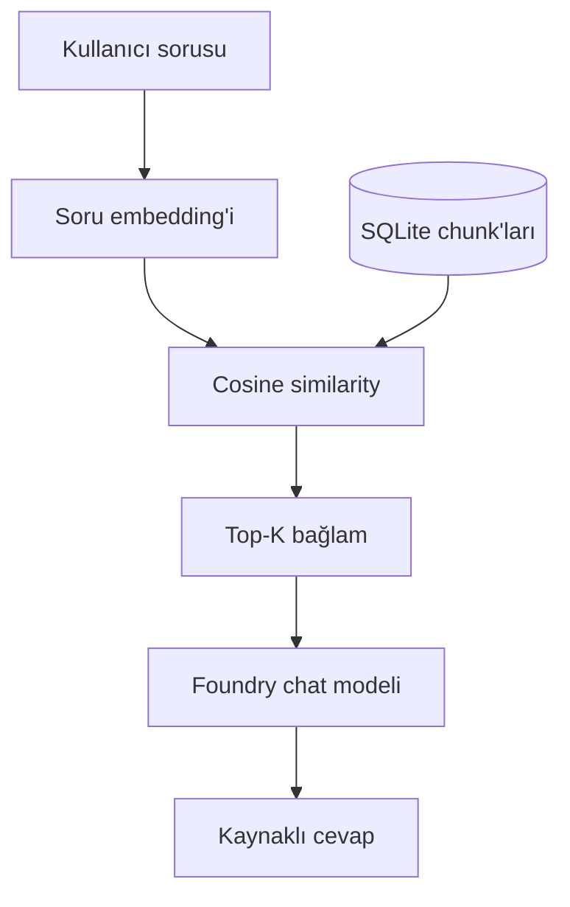

# Mimari

## İndeksleme akışı

## Soru-cevap akışı

## Katmanlar

| Katman | Dosya | Sorumluluk |
|---|---|---|
| Belge | `documents.py` | Dosya keşfi, PDF/metin okuma, normalizasyon, chunking |
| Veri | `database.py` | Belge ve embedding'lerin SQLite'ta saklanması |
| AI | `foundry.py` | Yerel modellerin indirilmesi, yüklenmesi ve çalıştırılması |
| RAG | `rag.py` | İndeksleme, similarity search, prompt ve cevap üretimi |
| Arayüz | `cli.py`, `streamlit_app.py` | Kullanıcı etkileşimi ve kaynakların gösterilmesi |

## Veritabanı şeması

`documents` tablosu kaynak dosyanın yolu, adı, SHA-256 özeti ve indeksleme zamanını
tutar. SHA-256 özeti değişmeyen belgelerin tekrar embedding işleminden geçirilmesini
önler.

`chunks` tablosu her parçanın metnini, sayfa ve sıra bilgisini ve JSON biçimindeki
embedding vektörünü saklar. Bir belge silinirse ona bağlı chunk'lar foreign key
üzerinden silinir.

## Güvenilirlik önlemleri

1. Sistem prompt'u yalnızca getirilen bağlamın kullanılmasını ister.
2. En yüksek benzerlik skoru eşikten düşükse chat modeli çağrılmaz.
3. Kullanıcıya alınan kaynak metin ve skor gösterilir.
4. Uygulama resmî danışmanlık olmadığına dair uyarı gösterir.
